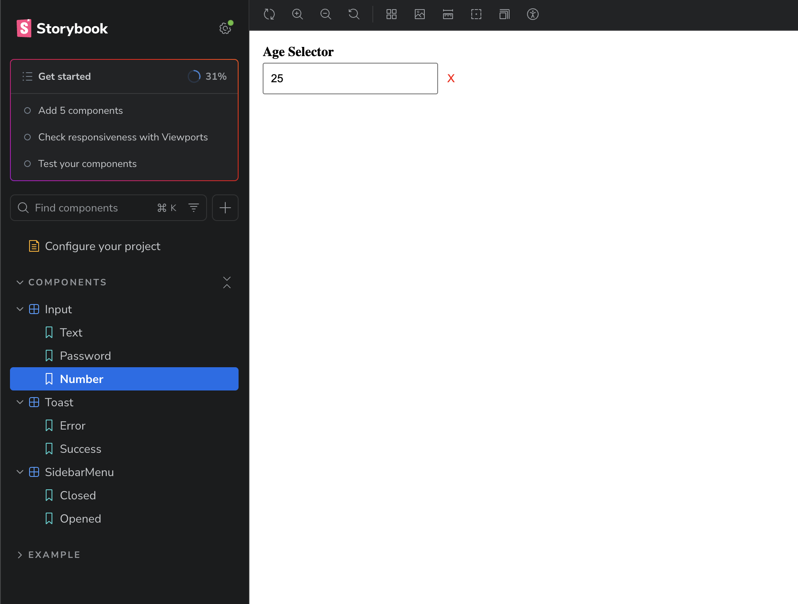
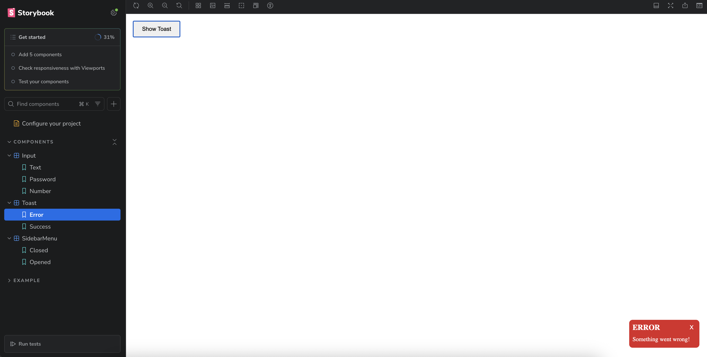

# React Component Library - Test Assessment

## 🚀 Setup Instructions
1. Clone the repository: `git clone <>`
2. Install dependencies: `npm install`
3. Launch Storybook: `npm run storybook`

## 🧩 Component Overview

### 1. Input Component
- **Features**: Supports text, password, and number types. Includes a clearable "X" button and password visibility toggle.

| Empty State | Password State | Number State |
| :---: | :---: | :---: |
|  |  |  |

### 2. Toast Notification
- **Features**: Auto-dismisses after a set duration. Uses **Framer Motion** for slide-in/out animations.
- **Logic**: Styled via SCSS Modules using data-attributes for success/error types.

| Success Toast | Error Toast |
| :---: | :---: |
|  |  |

### 3. Sidebar Menu
- **Features**: Persistent 72px left-rail when collapsed. Expands into a nested accordion menu.
- **Behavior**: Closes when the background is clicked.

| Sidebar Expanded | Sidebar Collapsed |
| :---: | :---: |
|  |  |

## 🛠 Tech Stack
- **React + TypeScript + Vite**
- **Storybook** for UI documentation
- **SCSS Modules** for scoped styling
- **Framer Motion** for animations